# Proyecto AROMA CAFE CRUCEÑO - Desarrollo de Sistema II
## Universida Privada Doomingo Savio
- `Pagina de Facebook de la universidad`: 
Puedes acceder al siguiente enlace para ingresar a la página de facebook de nuestra Universidad <a href="https://www.facebook.com/UPDS.bo">UPDS.com</a>.

## Descripción
Este repositorio contiene el código y la documentación relacionados con el sistema de gestión de ventas y usuarios para la cafetería "Aroma Café Cruceño", ubicada en Santa Cruz de la Sierra, Bolivia. El objetivo de este proyecto es mejorar la eficiencia en la administración de ventas y usuarios en la cafetería, optimizando los procesos y proporcionando una mejor experiencia tanto para el personal como para los clientes.

## Contenido del Avance
Imagenes y videos de la Interfaz y Diagrama de la Base de Datos (Aroma Café Cruceño) :

### Diagrama de nuestra base de datos:
  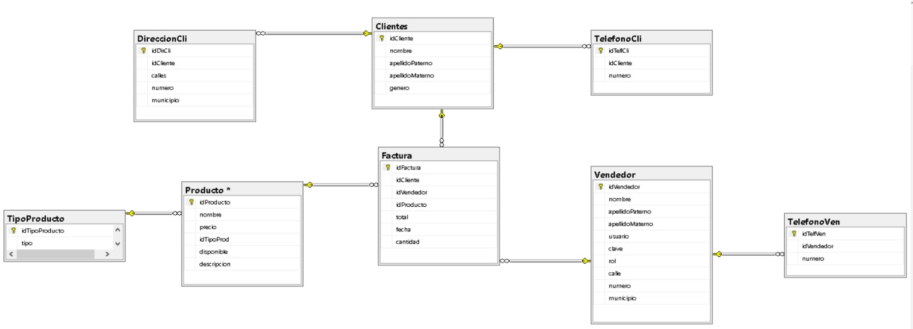
### Login:
Para entrar se necesita un usuario y una contraseña
   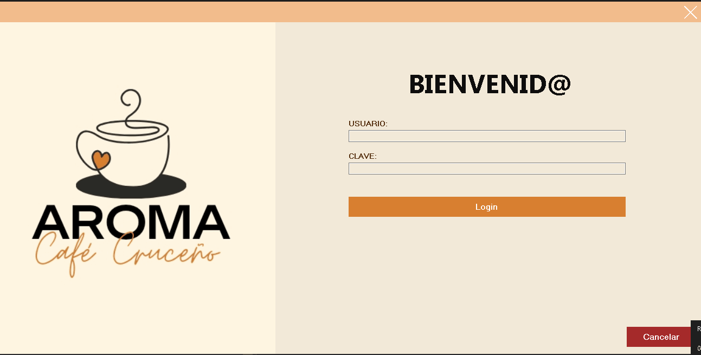
   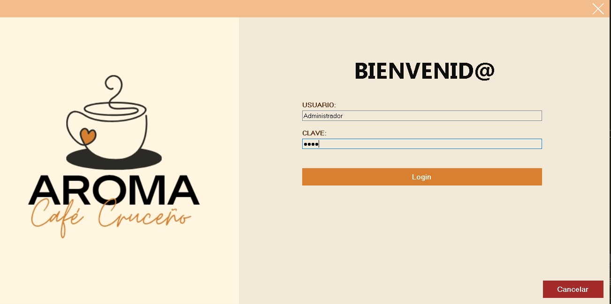
### Interfaz Principal
 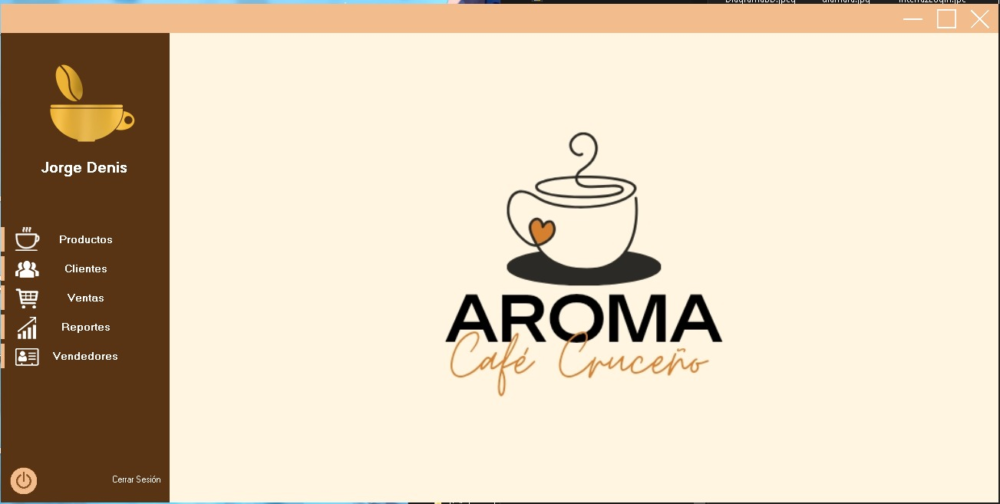
### Usuario: 
Habra una ventana donde estaran los datos personales del usuario que haya ingresado   
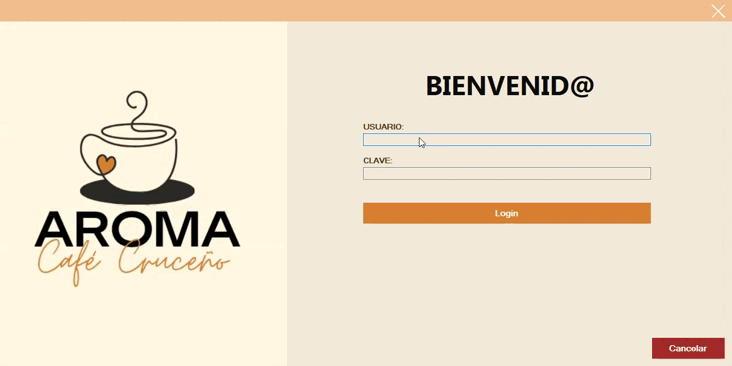

El Administrador tendra acceso a la interfaz Vendedores y podra añadir más
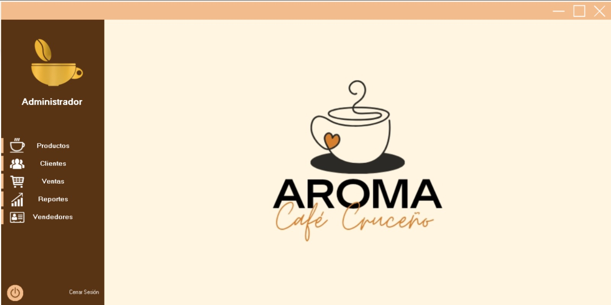
Mientras que el vendedor no tendra acceso y no podra ver esta interfaz
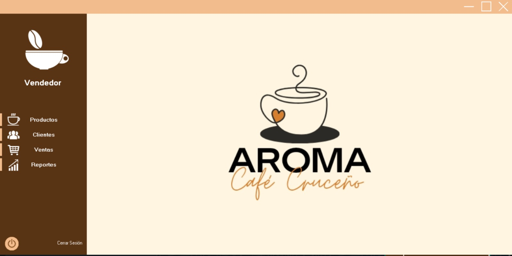
### Interfaz Productos:
En esta interfaz se ingresara los productos de Aroma Café Cruceño
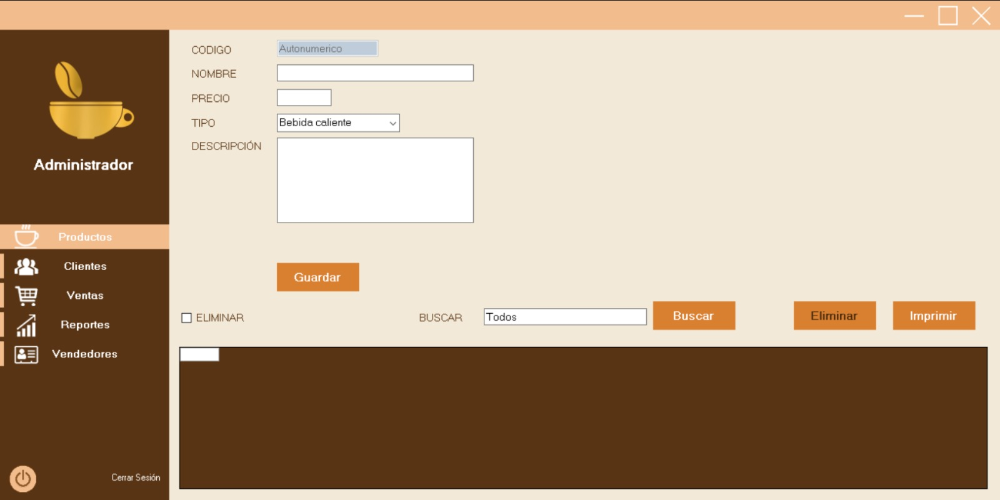
### Interfaz Clientes:
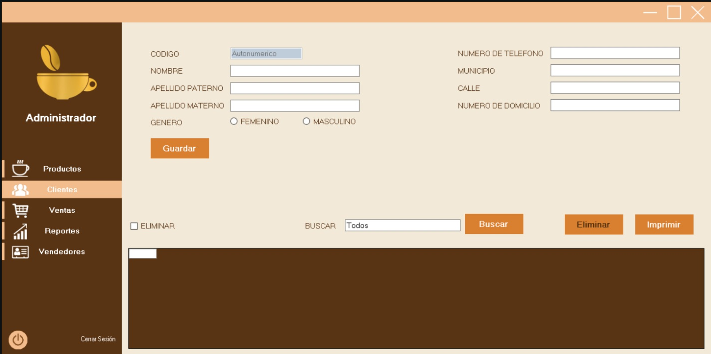
### Interfaz Ventas:
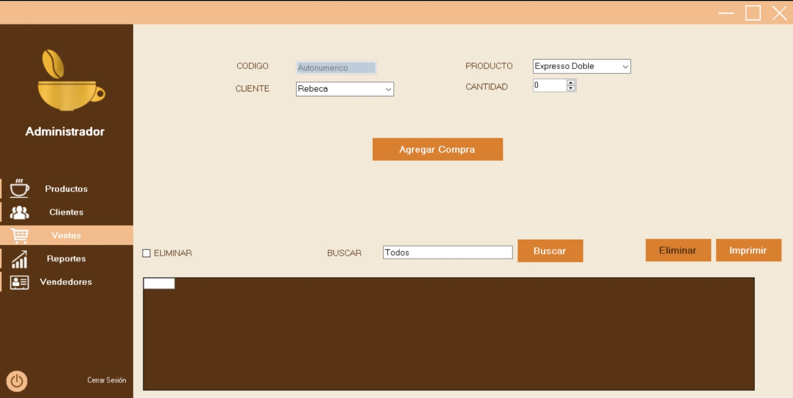
### Reportes de Ventas:
Se puede buscar los datos de las ventas por fecha, por rango, por mes, día y también por año
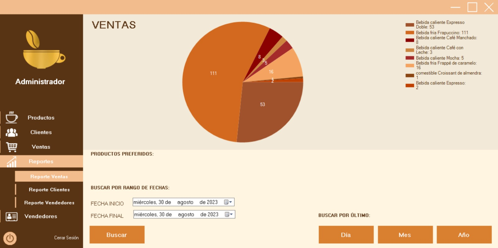
### Reportes de Clientes:
Se puede buscar los datos de los clientes por fecha, por rango, por mes, día y también por año
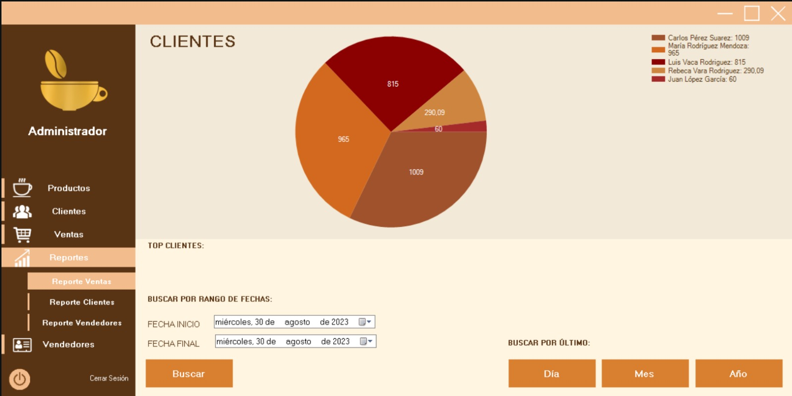
### Reportes de Vendedores:
Se puede buscar los datos de los vendedores por fecha, por rango, por mes, día y también por año
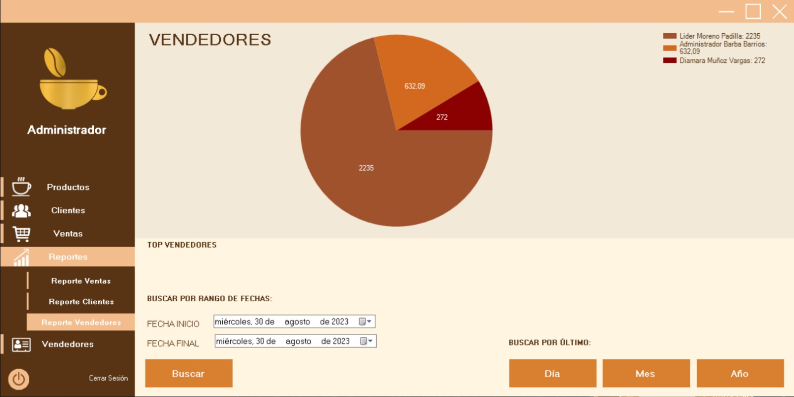
### Interfaz Vendedores:
Esta interfaz solo el administrador puede ingresar y realizar cambios
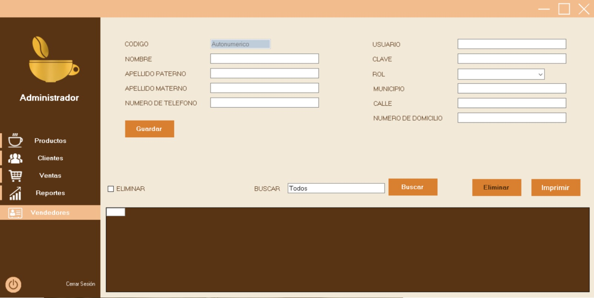

## Contacto
¿Tienes preguntas, sugerencias o comentarios sobre el proyecto "CAFE CRUCEÑO"? No dudes en contactarnos:

- Jorge Denis Barba Barrios:
Correo Electrónico: <a href="mailto:sc.jorge.barba.b@upds.net.bo">Hacer clic aquí para redactar un correo a Jorge</a>

## Notas
- Este proyecto es parte de un trabajo académico para la materia de Desarrollo de Sistemas II.

¡Gracias por tu interés en el proyecto "CAFE CRUCEÑO"!
